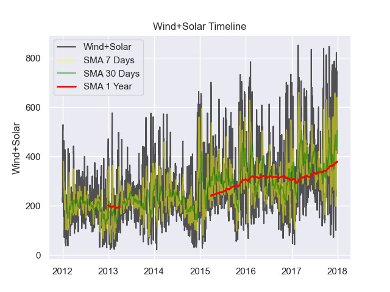

# Time Series Prediction
This task focuses on time series prediction using autoregressive modeling. It analyzes and forecasts data related to daily electrical consumption and temperature change over specific timelines. 
It explores two datasets: ***'data_cons.csv'*** and ***'data_mintemp.csv'***, which represent daily electrical consumption for 11 years (2006-2017) and temperature change over nine years (1981-1990), respectively. 
The primary objective is to make accurate forecasts based on these datasets.

## Data 
### Temperature Change Data
The ***'data_mintemp'*** dataset covers a nine-year period, from 1981 to 1990, and tracks temperature changes. It serves as a valuable source of information for understanding temperature fluctuations over time.
Temperature change data often exhibits long-term climate trends, including global warming or cooling patterns.

### Electrical Consumption Data
The ***'data_cons'*** dataset contains daily electrical consumption data for an area spanning 11 years, from 2006 to 2017. This dataset provides insights into electricity usage patterns over a substantial time frame.
Hence, we can predict future electrical consumption based on historical data.

  

## Simple Moving Average (SMA)
A Simple Moving Average (SMA) was calculated for each of the three datasets over a specific time in the past. This takes the arithmetic mean of the values over a previous amount of days that we set (7 - weekly, 30 - monthly, 365 - yearly) to identify a trend direction in our data for a customizable timeframe. 
While it is impossible to predict the future with certainty, this method creates an 'expected' idea through research.

## Autoregression (AR)
Autoregressive (AR) modeling is a key component of this project. AR models rely on past observations to forecast future values, making them suitable for making predictions based on historical data, and optimal at time series prediction tasks.
It considers factors like seasonality and trends in the data to make accurate predictions.

### Autoregressive Parameters
The AR model's parameters, including $a$ (AR coefficients) and $\sigma$ (noise variance), are calculated using methods such as the Yule-Walker method with [Maximum Likelihood Estimation (MLE)](https://en.wikipedia.org/wiki/Maximum_likelihood_estimation).

## Installation:
1. Clone the repository:

    git clone [https://github.com/mrgeooo14/travelling_salesman_problem.git](https://github.com/mrgeooo14/DS-Time-Series-Prediction.git)

2. Navigate to the project directory.

3. Run the program:

    **python main.py**

4. Monitor the graphs that visualize the results of SMAs, autocorrelation, and overall final AR prediction. 

